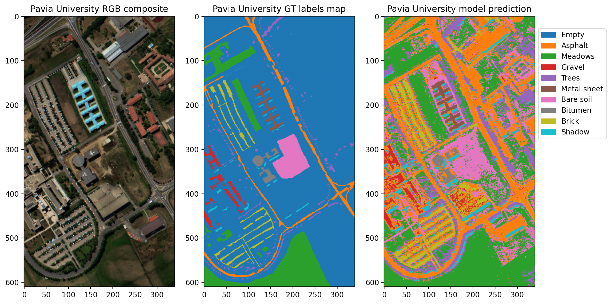

# Remote Sensing – Introduction to Using Machine Learning for Satellite Data



A sneak-peak lesson about applying machine learning to satellite imagery by the example of terrain segmentation on the Pavia University dataset.

You can either follow this lesson by reading the Jypyter notebook or execute it interactively.

## Obtaining the data

The Pavia University dataset is taken from [Kaggle](https://www.kaggle.com/datasets/syamkakarla/pavia-university-hsi), the original dataset can be also obtained from *Grupo de Inteligencia Computacional*'s data [collections](https://www.ehu.eus/ccwintco/index.php/Hyperspectral_Remote_Sensing_Scenes). You have to download both the Pavia University hyperspectral cube, as well as, the ground truth labels file.

To automate this process you can also use [git-lfs](https://git-lfs.com). To use git-lfs on Debian-based distros run:

```
sudo apt install git-lfs
git lfs pull
```

## Environment preparation

Python (preferably 3.10) is required. To setup the environment using `virtualenv` run:

```
pip install virtualenv
virtualenv venv
source venv/bin/activate
pip install -r requirements.txt
```

## Running Jypyter Notebooks

Depending on your operating system and experience with Python you may want to install Jypter and Python in different ways. Try to search the web for the most suitable version for you.
